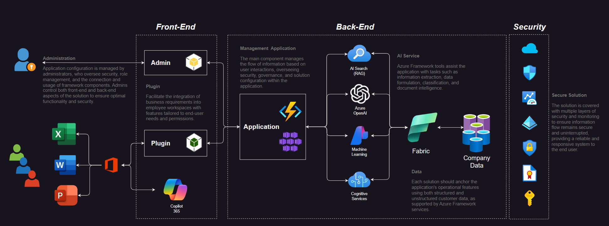

# Office 365 Legal Plugin  
  
## Overview  
  
The Office 365 Legal Plugin is a powerful tool designed to enhance the efficiency and productivity of legal professionals when reviewing contracts. Similar to solutions like Harvey and Spellbook, this plugin leverages advanced AI capabilities to help lawyers summarize, review, check for policy and compliance, and make corrections and redlining in a fast and efficient manner. Built with Microsoft's best-of-breed technologies, it offers an end-to-end solution using Azure infrastructure, Azure AI, and Office 365, with the flexibility of an open-source code base for customization.  
  
## Key Features  
  
- **Efficient Contract Review:** Streamline the process of contract review with AI-driven summarization and analysis.  
- **Policy and Compliance Checks:** Ensure compliance with company policies through integrated policy checks.  
- **Customizable Solution:** Modify and extend functionalities with access to the open-source code.  
- **Flexible Deployment Options:** Deploy locally or use Docker with AKS, or integrate with Azure AI Studio and PromptFlow.  
  
## Architecture  
  
The plugin's architecture consists of a front-end UI, developed in JavaScript, integrated directly into Microsoft Word as an Office 365 plugin. The back end employs Azure PromptFlow, which acts as an orchestration engine triggered by plugin commands. PromptFlow operates in AKS with Docker or in Azure AI Studio, utilizing two Azure AI Search indexes—one for document data and another for company policy. The runtime for PromptFlow is Python, enabling Azure OpenAI LLM calls for summarization and compliance checks. The solution's configuration, including API keys, is stored within the plugin and can be modified via the configuration tab.  
  

## Prerequisites  
  
To install and run the plugin locally, ensure you have the following:  
  
- Office 365  
- Node.js and NPM  
- Python  
- Visual Studio Code  
- PromptFlow libraries  
- Azure OpenAI with GPT-4o model and Ada-002 for embedding  
- Azure AI Search (Basic tier)  
- Azure AI Studio for PromptFlow or AKS for Docker usage  
  
## Installation  
  
**Local Installation:**  
  
1. Ensure all prerequisites are installed.  
2. Clone the repository to your local machine.  
3. Navigate to the solution directory.  
4. Run `npm install` to install dependencies.  
5. Start the plugin with `npm start`.  
  
**Office 365 Deployment:**  
  
- (Instructions TBD)  
  
## Azure Services Configuration  
  
- (Configurations TBD)  
  
## User Interaction  
  
- (A video will be provided to demonstrate user interaction and main workflows.)  
  
## Deployment to AKS or Docker  
  
The solution includes a Docker folder within the PromptFlow directory for deployment. After deployment in the PromptFlow connector, update the endpoint information. Ensure connection parameters for OpenAI and Azure Search are set correctly.  
  
## Importing into Azure AI Studio  
  
Import the PF Yaml file from the PromptFlow folder and configure the necessary connections.  
  
## Intellectual Property and Licensing  
  
This plugin is free to use and modify by anyone. The GitHub repository is also free to use and change.  
  
## Contributing  
  
We welcome contributions from the community. Feel free to create a pull request or leave comments. I will review all contributions.  
  
## Reporting Issues and Contributions  
  
Please email any issues or contributions to [liorarmiev@microsoft.com](mailto:liorarmiev@microsoft.com).  
  
## Additional Resources  
  
- (Additional documentation, tutorials, or demos will be linked here. TBD)  