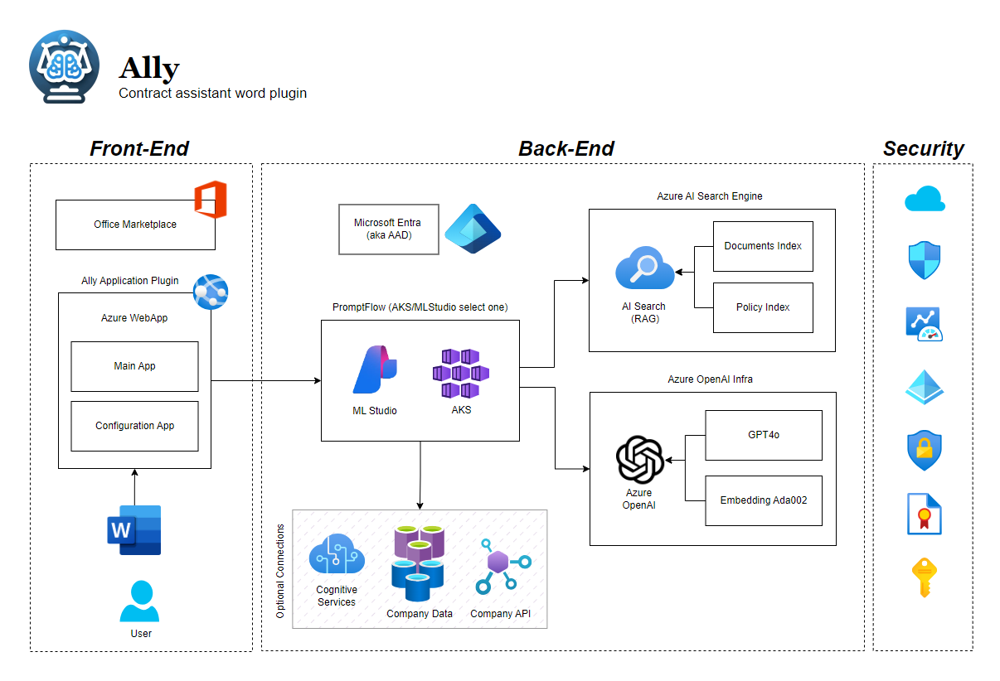

# Office 365 Legal Plugin  

## Overview  
  
The Office 365 Legal Plugin is an innovative solution meticulously crafted to transform the landscape of contract management for legal professionals. This sophisticated tool harnesses the power of advanced artificial intelligence to streamline the intricate processes of document summarization, comprehensive review, policy compliance verification, and the application of corrections and redlining. By integrating seamlessly with Microsoft Word within the Office 365 suite, the plugin provides a native and intuitive user experience.

At the heart of this plugin is the robust infrastructure of Azure, coupled with Azure AI’s cutting-edge capabilities, delivering an unparalleled end-to-end contract management solution. This integration not only enhances the speed and accuracy of contract processing but also ensures that legal professionals can focus on more strategic aspects of their work.

The Office 365 Legal Plugin is designed with flexibility and scalability in mind. Its open-source code base allows organizations to tailor the solution to their unique requirements, offering a customizable platform that can evolve alongside changing business needs. Whether deployed in a local environment or within a larger cloud-based infrastructure using Docker and Azure Kubernetes Service (AKS), this plugin adapts to diverse IT architectures, ensuring optimal performance and reliability.

By leveraging this plugin, legal teams can significantly reduce the time spent on manual tasks, thereby increasing overall productivity and enabling a sharper focus on delivering value to clients. Embrace the future of legal technology with a solution that combines Microsoft’s best-of-breed offerings to redefine efficiency and efficacy in legal contract management.
  
## Key Features  
  
- **Efficient Contract Review:** Streamline the process of contract review with AI-driven summarization and analysis.  
- **Policy and Compliance Checks:** Ensure compliance with company policies through integrated policy checks.  
- **Customizable Solution:** Modify and extend functionalities with access to the open-source code.  
- **Flexible Deployment Options:** Deploy locally or use Docker with AKS, or integrate with Azure AI Studio and PromptFlow.  
  
## Architecture  
  
The plugin's architecture consists of a front-end UI, developed in JavaScript, integrated directly into Microsoft Word as an Office 365 plugin. The back end employs Azure PromptFlow, which acts as an orchestration engine triggered by plugin commands. PromptFlow operates in AKS with Docker or in Azure AI Studio, utilizing two Azure AI Search indexes—one for document data and another for company policy. The runtime for PromptFlow is Python, enabling Azure OpenAI LLM calls for summarization and compliance checks. The solution's configuration, including API keys, is stored within the plugin and can be modified via the configuration tab.  
  


## Prerequisites  
  
To install and run the plugin locally, ensure you have the following:  
  
- Office 365  
- Node.js and NPM  
- Python  
- Visual Studio Code  
- PromptFlow libraries  
- Azure OpenAI with GPT-4o model and Ada-002 for embedding  
- Azure AI Search (Basic tier)  
- Azure AI Studio for PromptFlow or AKS for Docker usage  

> [!NOTE]  
> Use Azure OpenAi GPT4o with the `2024-08-06` model version

## Installation  
  
**Local Installation:**  
  
1. Ensure all prerequisites are installed.  
2. Clone the repository to your local machine.  
3. Navigate to the solution directory.  
4. Run `npm install` to install dependencies.  
5. Start the plugin with `npm start`.  
6. Go to the PrompFlow  folder
7. If not using Docker with PromptFlow you will need to create 2 connectors
- Name: azuresearch

    This is a Custom connector not the PromptFlow "Azure AI Search" connector
    this is the configuration file for the connector for example:
    ```
    $schema: https://azuremlschemas.azureedge.net/promptflow/latest/CustomConnection.schema.json
    type: custom
    name: azuresearch
    configs:
    endpoint: ${env:AZURESEARCH_ENDPOINT}
    secrets:
    key: ${env:AZURESEARCH_KEY}
    module: promptflow.connections
    ```

>[!NOTE]
>the only 2 paramiters needed are `endpoint` and `key`


- Name: azureopenai

    This is an AzureOpenAI Connector with the next schema:
    ```
    $schema: https://azuremlschemas.azureedge.net/promptflow/latest/AzureOpenAIConnection.schema.json
    type: azure_open_ai
    name: azureopenai
    module: promptflow.connections
    api_base: ${env:AZUREOPENAI_API_ENDPOINT}
    api_key: ${env:AZUREOPENAI_API_KEY}
    api_type: azure
    api_version: ${env:AZUREOPENAI_API_VERSION}
    auth_mode: key
    ```

    using PromptFlow Plugin for VSCode is recomanded.

8. Run `pf flow serve --source . --port 8083 --host localhost`
9. This will load a local web on port `8083` and can be used by the Plugin
10. /cofig/cofig.json file need to hold the endpoint of the PromptFlow endpoint under the `prompt-flow-endpoint`
    for exmaple `"prompt-flow-endpoint" : "http://localhost:8083/score"` for local run of PF


**Office 365 Deployment:**  
  
- (Instructions TBD)  
  
## Azure Services Configuration  
  
### Azure Search
- for the solution to work where will need to be Azure Search 2 Indexes:
    - `legal-instructions`
        This Index is holding add customer Policy Chunks with the next table fields:

        | Field Name | Type | 
        | ---------- | ---- | 
        | id | String | 
        | title | String |
        | instruction | String | 
        | embeding | SingleCollection |
    - `legal-documents`
        This Index is holding all the chunks of the Documents provided for the plugin review:
        | Field Name | Type | 
        | ---------- | ---- | 
        | id | String |
        | title | String |
        | paragraph | String |
        | keyphrases | StringCollection |
        | summary | String | 
        | embedding | SingleCollection | 
        | filename | String | 
        | department | String |
        | data | DateTimeOffset | 
  
## User Interaction  
  
- (A video will be provided to demonstrate user interaction and main workflows.)
  
## Deployment to AKS or Docker  
  
The solution includes a Docker folder within the PromptFlow directory for deployment. After deployment in the PromptFlow connector, update the endpoint information. Ensure connection parameters for OpenAI and Azure Search are set correctly.  

Working with the Docker file steps:
1. Go to docker folder in the project
2. Run `docker build -t {Give you name for the container} .`
3. Run the container with port `8083` and the next paramiters:
    - AZURESEARCH_KEY
    - AZURESEARCH_ENDPOINT
    - AZUREOPENAI_API_KEY
    - AZUREOPENAI_API_ENDPOINT
    - AZUREOPENAI_API_VERSION `2024-08-06`
4. Run the Word Plugin 
5. Navigate to the solution directory.  
6. Run `npm install` to install dependencies.  
7. Start the plugin with `npm start`. 
  
## Importing into Azure AI Studio  
  
Import the PF Yaml file from the PromptFlow folder and configure the necessary connections.
  
## Intellectual Property and Licensing  
  
This plugin is free to use and modify by anyone. The GitHub repository is also free to use and change.  
  
## Contributing  
  
We welcome contributions from the community. Feel free to create a pull request or leave comments. I will review all contributions.  
  
## Reporting Issues and Contributions  
  
Please email any issues or contributions to [liorarmiev@microsoft.com](mailto:liorarmiev@microsoft.com).  
  
## Additional Resources  
  
- (Additional documentation, tutorials, or demos will be linked here. TBD)  